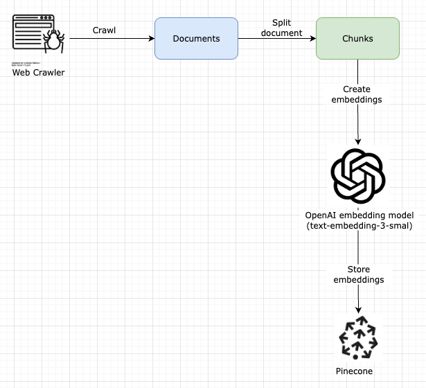

# 🚀 Launchbot - AI chatbot for LaunchDarkly docs

Launchbot is an intelligent chatbot that provides instant answers to LaunchDarkly documentation questions using RAG (Retrieval-Augmented Generation) technology.

### Architecture

The project consists of two main components:

- **launchbot/** - Python FastAPI backend with RAG implementation
- **launchbot-ui/** - React TypeScript frontend with real-time streaming UI

### Features

- 🤖 **AI-Powered Answers**: Uses OpenAI GPT-4 to generate accurate, context-aware responses
- 📚 **Documentation Search**: Semantic search over LaunchDarkly documentation using Pinecone vector database
- ⚡ **Real-time Streaming**: Streams responses token-by-token for instant feedback
- 🔗 **Source Citations**: Provides source links for all answers
- 🎨 **Syntax Highlighting**: Code snippets are beautifully formatted with PrismJS
- 🕷️ **Auto-Indexing**: Web crawler to automatically scrape and index LaunchDarkly docs

---

## Backend (launchbot/)

### Tech Stack

- **FastAPI** - Modern, high-performance web framework
- **LangChain** - Framework for building LLM applications
- **Pinecone** - Vector database for semantic search
- **OpenAI GPT-4** - Large language model for generating responses
- **BeautifulSoup4** - Web scraping library

### Project Structure

```
launchbot/
├── main.py                          # FastAPI server entry point
├── bot.py                           # RAG retrieval logic with streaming
├── crawler.py                       # Web crawler for LaunchDarkly docs
├── index_documents_in_pinecone.py   # Script to index documents
├── config.py                        # Configuration and initialization
├── model.py                         # Pydantic models
└── requirements.txt                 # Python dependencies
```

### Setup

1. **Create a virtual environment**:

   ```bash
   cd launchbot
   python3 -m venv venv
   source venv/bin/activate  # On Windows: venv\Scripts\activate
   ```

2. **Install dependencies**:

   ```bash
   pip install -r requirements.txt
   ```

3. **Set up environment variables**:
   Create a `.env` file in the `launchbot/` directory:

   ```env
   OPENAI_API_KEY=your_openai_api_key
   PINECONE_API_KEY=your_pinecone_api_key
   PINECONE_INDEX_NAME=your_index_name
   PINECONE_ENVIRONMENT=your_environment
   ```

4. **Index the documentation** (first time only):

   ```bash
   python index_documents_in_pinecone.py
   ```

   This will crawl LaunchDarkly documentation and store embeddings in Pinecone.

5. **Start the server**:
   ```bash
   uvicorn main:app --reload
   ```
   The API will be available at `http://localhost:8000`

### API Endpoints

#### `POST /ask`

Ask a question and receive a streaming response.

**Request Body**:

```json
{
  "question": "How do you install ldcli on macOS using Homebrew?"
}
```

**Response**: Server-Sent Events (SSE) stream with:

- Streamed answer tokens
- Source documents at the end

---

## Frontend (launchbot-ui/)

### Tech Stack

- **React 19** - UI library
- **TypeScript** - Type-safe JavaScript
- **Vite** - Fast build tool
- **Tailwind CSS** - Utility-first CSS framework
- **PrismJS** - Syntax highlighting
- **React Icons** - Icon library

### Project Structure

```
launchbot-ui/
├── src/
│   ├── Launchbot.tsx                # Main chat component
│   ├── components/
│   │   ├── ChatInput.tsx            # Message input component
│   │   ├── MessageBubble.tsx        # Chat message display
│   │   └── TypingLoader/            # Typing animation
│   ├── hooks/
│   │   └── useLaunchbotQuery.ts     # Custom hook for API calls
│   ├── utils/
│   │   └── highlightContent.ts      # Markdown & code highlighting
│   └── stylesheets/
│       └── Launchbot.css            # Main styles
├── package.json
└── vite.config.ts
```

### Setup

1. **Install dependencies**:

   ```bash
   cd launchbot-ui
   npm install
   ```

2. **Start the development server**:

   ```bash
   npm run dev
   ```

   The UI will be available at `http://localhost:5173`

3. **Build for production**:
   ```bash
   npm run build
   ```

### Features

- **Real-time Streaming**: Messages stream in character-by-character
- **Markdown Support**: Renders formatted responses with headers, lists, and code blocks
- **Syntax Highlighting**: Automatically highlights code snippets
- **Source Links**: Displays documentation sources for each answer
- **Responsive Design**: Works on desktop and mobile devices

---

## Development Workflow

### Running Locally

1. **Terminal 1** - Start the backend:

   ```bash
   cd launchbot
   source venv/bin/activate
   uvicorn main:app --reload
   ```

2. **Terminal 2** - Start the frontend:

   ```bash
   cd launchbot-ui
   npm run dev
   ```

3. Open `http://localhost:5173` in your browser

### Re-indexing Documentation

If LaunchDarkly documentation is updated, re-index:

```bash
cd launchbot
python index_documents_in_pinecone.py
```

---

## How It Works

1. **Indexing Phase** (one-time):

   - Crawler scrapes LaunchDarkly documentation
   - Documents are split into chunks
   - Chunks are embedded using OpenAI embeddings
   - Embeddings are stored in Pinecone vector database

   

2. **Query Phase** (real-time):

   - User asks a question in the UI
   - Frontend sends question to backend API
   - Backend retrieves relevant document chunks from Pinecone
   - LangChain constructs a prompt with context
   - GPT-4 generates an answer based on context
   - Answer streams back to the frontend in real-time
   - Sources are displayed with the answer

   

---

## 💬 Sample Questions & Answers

Here are some example questions you can ask Launchbot and the type of responses you'll receive:

### Example 1: Installation Instructions

**Question**: _"How do you install ldcli on macOS using Homebrew?"_

**Answer**:

> **Installing ldcli on macOS using Homebrew**
>
> To install the LaunchDarkly CLI (ldcli) on macOS using Homebrew, follow these steps:
>
> 1. **Add the LaunchDarkly tap**:
>
>    ```bash
>    brew tap launchdarkly/tap
>    ```
>
> 2. **Install ldcli**:
>
>    ```bash
>    brew install ldcli
>    ```
>
> 3. **Verify the installation**:
>    ```bash
>    ldcli version
>    ```
>
> This will install the latest version of ldcli on your system.
>
> **Sources**:
>
> - https://launchdarkly.com/docs/cli/installation
> - https://launchdarkly.com/docs/cli/getting-started

---

### Example 2: Authentication

**Question**: _"Which environment variable is used to authenticate ldcli with LaunchDarkly?"_

**Answer**:

> **Authentication Environment Variable**
>
> The environment variable used to authenticate ldcli with LaunchDarkly is **`LD_ACCESS_TOKEN`**.
>
> You can set it in your terminal:
>
> ```bash
> export LD_ACCESS_TOKEN=your_access_token_here
> ```
>
> Alternatively, you can pass the access token directly using the `--access-token` flag with any ldcli command:
>
> ```bash
> ldcli --access-token YOUR_TOKEN command
> ```
>
> **Note**: Access tokens can be created in the LaunchDarkly dashboard under Account Settings → Authorization.
>
> **Sources**:
>
> - https://launchdarkly.com/docs/cli/authentication

---

### Example 3: Feature Flag Concepts

**Question**: _"What is a guarded rollout and how can I use that?"_

**Answer**:

> **Guarded Rollouts in LaunchDarkly**
>
> A **guarded rollout** is a feature release strategy that allows you to gradually roll out a feature to your users while monitoring key metrics and automatically halting the rollout if issues are detected.
>
> **How it works:**
>
> 1. **Set up metrics**: Define success metrics and guardrail metrics in LaunchDarkly
> 2. **Configure the rollout**: Specify the percentage increase over time (e.g., 10% every hour)
> 3. **Enable guardrails**: The system monitors your metrics in real-time
> 4. **Automatic protection**: If guardrail metrics exceed thresholds, the rollout automatically pauses
>
> **Example use case:**
>
> ```
> Rolling out a new checkout flow:
> - Start with 5% of users
> - Increase by 10% every 2 hours
> - Monitor: conversion rate, error rate, page load time
> - Auto-pause if error rate > 2% or conversion drops > 5%
> ```
>
> **Benefits:**
>
> - Reduces risk of widespread issues
> - Provides automated safeguards
> - Allows data-driven rollout decisions
> - Easy rollback if problems occur
>
> **Sources**:
>
> - https://launchdarkly.com/docs/home/releases/guarded-rollouts
> - https://launchdarkly.com/docs/home/experimentation

---

### Example 4: Quick Reference

**Question**: _"How to create an access token?"_

**Answer**:

> **Creating an Access Token in LaunchDarkly**
>
> To create an access token:
>
> 1. Navigate to **Account Settings** → **Authorization**
> 2. Click **Create token**
> 3. Enter a **name** for your token
> 4. Select a **role** (Reader, Writer, Admin, or custom role)
> 5. Optionally set an **expiration date**
> 6. Click **Save token**
> 7. **Copy the token immediately** - it won't be shown again!
>
> **Token Types:**
>
> - **Personal access tokens**: Tied to your user account
> - **Service tokens**: For automated systems and integrations
>
> **Best Practices:**
>
> - Use least-privilege roles
> - Set expiration dates for security
> - Rotate tokens regularly
> - Never commit tokens to version control
>
> **Sources**:
>
> - https://launchdarkly.com/docs/home/account-security/api-access-tokens

---

### Example 5: Managing Feature Flags

**Question**: _"How do I archive or delete old feature flags?"_

**Answer**:

> **Archiving and Deleting Feature Flags**
>
> LaunchDarkly allows you to archive or delete feature flags that are no longer needed. Here's how:
>
> **Archiving Flags (Recommended)**
>
> Archiving is the safer option as it preserves flag data and history:
>
> 1. Navigate to your **Feature Flags** list
> 2. Click on the flag you want to archive
> 3. Click the **Settings** tab
> 4. Scroll to the bottom and click **Archive flag**
> 5. Confirm the action
>
> **What happens when you archive:**
>
> - Flag becomes read-only across all environments
> - Flag disappears from the main flags list (accessible via "Archived" filter)
> - Historical data is preserved
> - Can be restored later if needed
>
> **Deleting Flags (Permanent)**
>
> ⚠️ **Warning**: Deletion is permanent and cannot be undone.
>
> 1. First, the flag must be **archived**
> 2. Go to the archived flags list
> 3. Open the archived flag
> 4. In Settings, click **Delete flag**
> 5. Type the flag key to confirm
> 6. Click **Delete permanently**
>
> **Best Practices:**
>
> - ✅ **Archive instead of delete** to maintain audit trails
> - ✅ Remove flag references from code before archiving
> - ✅ Use the Code References feature to find all flag usages
> - ✅ Communicate with your team before archiving flags
> - ✅ Test in lower environments first
> - ❌ Don't delete flags that might be referenced in production code
>
> **Using the CLI:**
>
> ```bash
> # Archive a flag
> ldcli flags archive --flag-key my-flag-key --project my-project
>
> # Delete a flag (must be archived first)
> ldcli flags delete --flag-key my-flag-key --project my-project
> ```
>
> **Tip**: Enable the "Code References" integration to automatically detect where flags are used in your codebase before archiving them.
>
> **Sources**:
>
> - https://launchdarkly.com/docs/home/flags/archive-delete
> - https://launchdarkly.com/docs/home/code/flag-archive
> - https://launchdarkly.com/docs/cli/flags

---

### Example 6: Complex Multi-Source Query

**Question**: _"How can I gradually roll out a feature to users in a specific segment while monitoring conversion rates, and what should I do if the metrics drop?"_

**Answer**:

> **Implementing a Monitored Segment-Based Rollout**
>
> This requires combining several LaunchDarkly features: segments, targeting rules, gradual rollouts, and experimentation. Here's a comprehensive approach:
>
> **Step 1: Create a User Segment**
>
> 1. Go to **Segments** in your LaunchDarkly dashboard
> 2. Click **Create segment**
> 3. Define your targeting criteria (e.g., "premium_users" where `plan = "premium"`)
> 4. Save the segment
>
> **Step 2: Configure Feature Flag with Segment Targeting**
>
> 1. Create or edit your feature flag
> 2. In the **Targeting** tab, add a rule:
>    - **IF** user is in segment "premium_users"
>    - **THEN** serve variation based on percentage rollout
> 3. Set up percentage rollout (start with 10%)
>
> **Step 3: Set Up Experimentation & Metrics**
>
> 1. Navigate to **Experiments** → **Metrics**
> 2. Create a conversion metric:
>    ```
>    Event: "purchase_completed"
>    Success criteria: higher is better
>    ```
> 3. Attach the metric to your feature flag
> 4. Set up guardrail metrics (error rates, load times)
>
> **Step 4: Enable Guarded Rollout**
>
> 1. In your flag settings, enable **Guarded rollout**
> 2. Configure:
>    - Start: 10% of segment
>    - Increment: 15% every 4 hours
>    - Stop conditions: conversion drop > 5% OR error rate > 2%
>
> **If Metrics Drop:**
>
> **Automatic Response:**
>
> - Guarded rollout automatically pauses
> - Email alerts sent to team
> - Flag maintains current rollout percentage
>
> **Manual Investigation:**
>
> 1. Check **Experimentation dashboard** for metric trends
> 2. Review **Flag insights** for unusual patterns
> 3. Analyze **Event stream** for specific user issues
> 4. Use **Live events** to see real-time flag evaluations
>
> **Recovery Options:**
>
> ```bash
> # Option 1: Reduce rollout percentage
> ldcli flags update --flag-key feature-key --rollout 5
>
> # Option 2: Target specific stable segment
> ldcli flags update --flag-key feature-key --segment power-users-only
>
> # Option 3: Kill switch - instant rollback
> ldcli flags update --flag-key feature-key --on false
> ```
>
> **Best Practices:**
>
> - Start with smaller, more engaged segments
> - Set conservative guardrail thresholds initially
> - Monitor for at least 24 hours before expanding
> - Document what "success" looks like before starting
> - Have a rollback plan ready
>
> **Sources**:
>
> - https://launchdarkly.com/docs/home/targeting/segments
> - https://launchdarkly.com/docs/home/releases/guarded-rollouts
> - https://launchdarkly.com/docs/home/experimentation/manage
> - https://launchdarkly.com/docs/home/analyzing/metrics

---

### Example 7: Integration & Security Query

**Question**: _"What's the best way to use LaunchDarkly in a microservices architecture with different SDKs, and how do I secure the API keys across services?"_

**Answer**:

> **Microservices Architecture with LaunchDarkly**
>
> Managing feature flags across microservices requires careful architecture planning and security considerations.
>
> **Architecture Options:**
>
> **Option 1: Relay Proxy (Recommended for High-Scale)**
>
> The Relay Proxy acts as a local cache, reducing latency and API calls:
>
> ```yaml
> Architecture:
> ┌─────────────┐
> │ LaunchDarkly│
> │   Cloud     │
> └──────┬──────┘
>        │ (sync)
>   ┌────▼────────┐
>   │ Relay Proxy │ ← Single connection to LD
>   └────┬────────┘
>        ├──────┬──────┬──────┐
>        │      │      │      │
>     [API]  [Auth] [Cart] [Payment]
>    Service Service Service Service
> ```
>
> **Setup:**
>
> ```bash
> # Deploy Relay Proxy (Docker example)
> docker run \
>   -e LD_ENV_production=sdk-your-key \
>   -e LD_ENV_staging=sdk-staging-key \
>   -p 8030:8030 \
>   launchdarkly/ld-relay
> ```
>
> **Option 2: Direct SDK Integration**
>
> Each microservice connects directly (suitable for smaller deployments):
>
> ```javascript
> // Node.js Service
> const LD = require("launchdarkly-node-server-sdk");
> const client = LD.init(process.env.LD_SDK_KEY);
> ```
>
> ```python
> # Python Service
> import ldclient
> ldclient.set_sdk_key(os.environ['LD_SDK_KEY'])
> client = ldclient.get()
> ```
>
> **Security Best Practices:**
>
> **1. Environment-Based Keys**
>
> Use different SDK keys per environment:
>
> ```env
> # Production
> LD_SDK_KEY=sdk-production-xxxxxx
>
> # Staging
> LD_SDK_KEY=sdk-staging-xxxxxx
>
> # Development
> LD_SDK_KEY=sdk-dev-xxxxxx
> ```
>
> **2. Service Tokens (Not SDK Keys) for CI/CD**
>
> ```bash
> # For automated deployments and scripts
> export LD_ACCESS_TOKEN=api-xxxxxxxx  # Service token
> ldcli flags list --project my-project
> ```
>
> **3. Secrets Management Integration**
>
> **Kubernetes:**
>
> ```yaml
> apiVersion: v1
> kind: Secret
> metadata:
>   name: launchdarkly-keys
> type: Opaque
> data:
>   sdk-key: <base64-encoded-key>
> ---
> # Reference in deployment
> env:
>   - name: LD_SDK_KEY
>     valueFrom:
>       secretKeyRef:
>         name: launchdarkly-keys
>         key: sdk-key
> ```
>
> **AWS Secrets Manager:**
>
> ```javascript
> const AWS = require("aws-sdk");
> const secretsManager = new AWS.SecretsManager();
>
> const secret = await secretsManager
>   .getSecretValue({ SecretId: "launchdarkly/sdk-key" })
>   .promise();
>
> const client = LD.init(JSON.parse(secret.SecretString).sdkKey);
> ```
>
> **4. Network Segmentation**
>
> - Client-side SDKs: Use mobile/client keys (limited permissions)
> - Server-side services: Use SDK keys (full flag evaluation)
> - CI/CD pipelines: Use service tokens (API access only)
> - Never expose server-side keys in frontend code
>
> **5. Key Rotation Strategy**
>
> ```bash
> # Create new SDK key
> ldcli environments create-key --env production
>
> # Update services gradually (blue-green or canary)
> # Monitor for issues
> # Delete old key once migration complete
> ldcli environments delete-key --key old-key-id
> ```
>
> **Cross-Service Flag Consistency:**
>
> Use consistent user context across services:
>
> ```javascript
> // Shared user context structure
> const user = {
>   key: "user-123",
>   email: "user@example.com",
>   custom: {
>     service: "payment-service",
>     region: "us-east-1",
>     tier: "premium",
>   },
> };
> ```
>
> **Monitoring & Debugging:**
>
> - Enable LaunchDarkly's APM integrations (DataDog, New Relic)
> - Use distributed tracing to track flag evaluations
> - Set up alerting for SDK initialization failures
> - Monitor Relay Proxy health endpoints
>
> **Sources**:
>
> - https://launchdarkly.com/docs/home/relay-proxy
> - https://launchdarkly.com/docs/sdk/concepts/client-side-server-side
> - https://launchdarkly.com/docs/home/account-security/api-access-tokens
> - https://launchdarkly.com/docs/sdk/features/storing-data
> - https://launchdarkly.com/docs/home/account-security/keys

---

### Example 8: Troubleshooting Complex Scenario

**Question**: _"My feature flag is returning the wrong variation for some users but not others, and I can't figure out why. How do I debug this?"_

**Answer**:

> **Debugging Inconsistent Flag Evaluations**
>
> When flags behave unexpectedly for specific users, it's usually due to targeting rules, user context, or flag configuration. Here's a systematic approach:
>
> **Step 1: Use the Flag Evaluation Debugger**
>
> LaunchDarkly has built-in tools to see exactly why a user received a specific variation:
>
> 1. Go to your **Feature Flag** → **Targeting** tab
> 2. Click **Test targeting rules** (top right)
> 3. Enter the affected user's key
> 4. See the evaluation reason:
>    - Which rule matched?
>    - Was user in a segment?
>    - Percentage rollout bucket?
>
> **Step 2: Check User Context**
>
> The most common issue is incomplete or incorrect user context:
>
> ```javascript
> // ❌ BAD: Inconsistent user context
> const user1 = { key: "user-123" };
> const user2 = { key: "user-123", email: "user@example.com" };
> // These might evaluate differently if rules target email!
>
> // ✅ GOOD: Consistent, complete context
> const user = {
>   key: "user-123",
>   email: "user@example.com",
>   custom: {
>     plan: "premium",
>     signupDate: "2024-01-15",
>   },
> };
> ```
>
> **Step 3: Verify Evaluation Order**
>
> Rules are evaluated top-to-bottom; first match wins:
>
> ```
> Rule 1: If email ends with "@company.com" → Variation A
> Rule 2: If plan = "premium" → Variation B
> Rule 3: If segment = "beta-users" → Variation C
> Default: Variation D
>
> User: email="admin@company.com", plan="premium"
> Result: Variation A (Rule 1 matched first)
> ```
>
> **Step 4: Inspect User Segments**
>
> Verify segment membership:
>
> ```bash
> # Check if user is in segment
> ldcli segments get-user \
>   --segment-key beta-users \
>   --user-key user-123 \
>   --project my-project
> ```
>
> Common segment issues:
>
> - Case sensitivity in string matching
> - Numeric vs string comparisons ("123" ≠ 123)
> - Date format inconsistencies
> - Missing custom attributes
>
> **Step 5: Check Percentage Rollouts**
>
> Users are bucketed by hashing `(userKey + flagKey + salt)`:
>
> - Same user gets consistent variation for a flag
> - Different users distributed ~evenly
> - Changing flag key or salt re-buckets users
>
> ```bash
> # See which bucket a user falls into
> # Use the evaluation debugger or:
> ldclient.track('flag-evaluation-debug', user, {
>   flagKey: 'my-flag',
>   variation: variation,
> });
> ```
>
> **Step 6: Review Flag History**
>
> Check if rules changed recently:
>
> 1. Go to **Flag** → **History** tab
> 2. Look for recent changes in:
>    - Targeting rules
>    - Segment modifications
>    - Rollout percentages
>    - Default variations
>
> **Step 7: Use Live Events**
>
> Monitor real-time flag evaluations:
>
> 1. **Flags** → **Live events**
> 2. Filter by user key: `user-123`
> 3. Watch evaluations happen in real-time
> 4. See exact context sent from SDK
>
> **Step 8: SDK-Level Debugging**
>
> Enable verbose logging:
>
> ```javascript
> // Node.js
> const client = LD.init(sdkKey, {
>   logger: LD.basicLogger({ level: "debug" }),
> });
> ```
>
> ```python
> # Python
> import logging
> logging.basicConfig(level=logging.DEBUG)
> ldclient.set_config(Config(sdk_key, enable_log_evaluation_reasons=True))
> ```
>
> **Common Root Causes:**
>
> | Issue                         | Cause                             | Solution                            |
> | ----------------------------- | --------------------------------- | ----------------------------------- |
> | Variation flips between calls | User key changing/not consistent  | Ensure stable user key              |
> | Works in test, not production | Different SDK key/environment     | Verify environment configuration    |
> | Works for some users, not all | Targeting rule matches subset     | Review rule conditions              |
> | Recently stopped working      | Flag or segment recently modified | Check history and revert if needed  |
> | Different across services     | Inconsistent user context         | Standardize context across services |
> | Cached old variation          | SDK not receiving updates         | Check SDK connection and streaming  |
> | Flag not found                | Wrong project or environment      | Verify SDK initialization           |
>
> **Pro Tips:**
>
> - Use evaluation reasons in production (minimal overhead)
> - Set up flag change alerts for critical flags
> - Document expected behavior for complex targeting
> - Test targeting rules before deploying
> - Use feature flag aliases for easier debugging
>
> **Sources**:
>
> - https://launchdarkly.com/docs/home/flags/debugger
> - https://launchdarkly.com/docs/home/flags/targeting-users
> - https://launchdarkly.com/docs/sdk/features/evaluating
> - https://launchdarkly.com/docs/home/flags/variations
> - https://launchdarkly.com/docs/sdk/features/evaluation-reasons

---

### More Questions You Can Try

**Simple queries:**

- "What are feature flag targeting rules?"
- "How do I set up environments in LaunchDarkly?"
- "What is the difference between client-side and server-side SDKs?"

**Complex multi-source queries:**

- "How do I implement A/B testing with LaunchDarkly while ensuring GDPR compliance and user consent?"
- "What's the best approach for managing feature flags across multiple teams and preventing conflicts?"
- "How can I use LaunchDarkly with serverless functions and handle cold starts efficiently?"
- "What's the strategy for migrating from environment variables to feature flags in a large application?"
- "How do I integrate LaunchDarkly with my CI/CD pipeline to automate flag lifecycle management?"

---

## Environment Variables

### Backend (.env in launchbot/)

| Variable               | Description                             |
| ---------------------- | --------------------------------------- |
| `OPENAI_API_KEY`       | OpenAI API key for GPT-4 and embeddings |
| `PINECONE_API_KEY`     | Pinecone API key                        |
| `PINECONE_INDEX_NAME`  | Name of your Pinecone index             |
| `PINECONE_ENVIRONMENT` | Pinecone environment region             |

---
